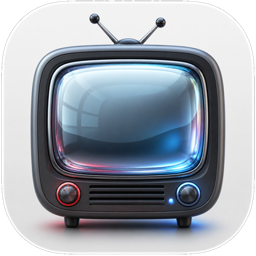

# App Identity

Date: 2026-07-01

## Direction

Tube should feel like a focused native Mac object, not a YouTube wrapper wearing browser chrome.

The strongest icon direction is a polished retro television rendered as a minimal liquid-glass Mac app icon. It gives the app a recognizable media shape while staying generic enough to avoid YouTube, Google, Apple, or browser-brand marks.

## Selected Icon Source

Current selected source:



- `docs/app-identity/tube-icon-retro-tv-user-source.png` - user-selected generated source image, 1254x1254.
- `docs/app-identity/tube-icon-retro-tv-master-clean.png` - current icon master with edge-connected black background removed to transparency, 1254x1254 RGBA.
- `docs/app-identity/tube-icon-retro-tv-master-clean-256.png` - small preview/export check.

The selected icon works because:

- the television silhouette reads immediately at app-icon size;
- the glass screen matches Tube's liquid-glass native app direction;
- the red and blue knobs add character without becoming a YouTube play mark;
- there is no text, logo, URL bar, triangle play glyph, or trademarked mark;
- the black corner background has been removed as alpha transparency.

Earlier generated concept sources:

- `docs/app-identity/tube-icon-concept-liquid-glass-retro-tv.png` - original generated square PNG source, 1254x1254.
- `docs/app-identity/tube-icon-concept-liquid-glass-retro-tv-1024.png` - normalized 1024x1024 app-icon candidate.
- `docs/app-identity/tube-icon-concept-liquid-glass-retro-tv-256.png` - small preview/export check.
- `docs/app-identity/tube-liquid-glass-retro-tv-icon-concept.png` - secondary generated concept, 1254x1254.

Current icon risks to clean up before shipping:

- the antennae and knobs may become noisy below 32px;
- the white rounded plate may need a final hand mask before public distribution;
- the source is generated raster art, so a final shipping pass should retouch edges, reflections, and small-size readability deliberately.

## Current Implementation

The selected concept is now wired into the app as a real macOS identity asset:

- `scripts/clean-app-icon-source.py` removes edge-connected dark background pixels from a source image while preserving the dark TV body.
- `Tube/Assets.xcassets/AppIcon.appiconset` contains the exported icon sizes from 16px through 1024px.
- `Tube/AppIcon.icns` is generated from the asset catalog and copied into the app bundle.
- `Build/Tube.app/Contents/Resources/AppIcon.icns` and `Build/Tube.app/Contents/Resources/Assets.car` are included by `scripts/build-app.sh`.
- `Tube/Info.plist` declares `CFBundleIconFile`, `CFBundleIconName`, version/build metadata, copyright, and `NSPrincipalClass`.
- `About Tube` uses a custom AppKit About panel with the app icon, version, build, and a short privacy summary.

## Production Plan

1. Treat the selected generated PNG as direction art, not final source of record. Done for v1.
2. Export a macOS icon set from the selected image: 16, 32, 64, 128, 256, 512, and 1024px PNGs. Done.
3. Add the exports under `Tube/Assets.xcassets/AppIcon.appiconset`. Done.
4. Compile the asset catalog to `AppIcon.icns` and copy it into `Build/Tube.app/Contents/Resources`. Done.
5. Add bundle icon, copyright, version/build, About panel, and privacy metadata. Done.
6. Future polish: retouch a final master with simplified small-size controls and stronger dark-background separation before public distribution.

## Generated Prompt

```text
Use case: logo-brand
Asset type: macOS app icon concept source, square 1024x1024 PNG
Primary request: liquid glass retro tv apple mac icon
Subject: A friendly minimal retro television silhouette for an app named Tube, rendered as a modern macOS-style app icon. The TV has softly rounded corners, a subtly convex glass screen, tiny abstract side controls, and a short pedestal/base; it should feel like a single-site video browser, not a media-company logo.
Style/medium: polished 3D icon render, liquid-glass material, translucent layered glass, soft refractions, high-end native macOS app icon feel.
Composition/framing: centered object, icon-safe padding, rounded-square app-icon composition, readable at small sizes, no text.
Lighting/mood: clean studio lighting, luminous but restrained, premium and calm.
Color palette: graphite, clear glass, soft white highlights, muted cyan reflections, tiny warm red accent only as an abstract indicator light. Avoid large red play-button shapes.
Materials/textures: frosted translucent glass shell, brushed graphite metal base, glossy screen with subtle depth.
Constraints: no Apple logo, no YouTube logo, no play triangle, no trademarked marks, no letters, no words, no watermark, no browser chrome, no visible URL bar.
Avoid: brand logos, bitten apple shape, YouTube red rounded rectangle, video play triangle, text, busy background, realistic CRT clutter.
```
